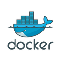
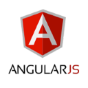
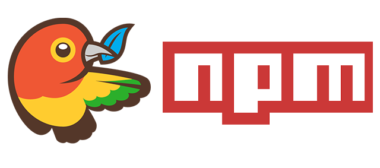

# Docker Gulp Angular image






## Table of Contents
  - [Requirements](#requirements)
  - [Docker build](#docker-build)
  - [Docker run](#docker-run)
  - [Docker stop](#docker-stop)
  - [Docker cheat sheet](https://github.com/wsargent/docker-cheat-sheet)
  - [Cleaning untagged images](#cleaning-untagged-images)

## Requirements

You have to install [Docker](https://www.docker.com/) following the [installation steps](https://docs.docker.com/engine/installation/) (choose your OS).

## Docker Build

There are two options to build the image:

### Building the entire image

You can build the app from this directory running:

```
docker build -t agomezmoron/docker-gulp-angular .
```

### Pulling from Docker

You can pull the image from Docker:

```
docker pull agomezmoron/docker-gulp-angular
```

## Docker Run

Run the image with the following command:

```
docker run --privileged -v /YOUR/SOURCES/FOLDER:/src -p 90:8080  -e GULP_TASK="YOUR_GULP_TASK" -d -t -i agomezmoron/docker-gulp-angular
```

or

docker run --privileged -v /YOUR/SOURCES/FOLDER:/src -p 90:8080  -e GULP_TASK="YOUR_GULP_TASK" -t -i agomezmoron/docker-gulp-angular

And you will have your docker running on the 90 port.

## Docker Stop

Once Docker is running our image, there is a way to stop it:

 * Execute **docker ps** and you will get the Container ID.
 * Then, execute **docker kill CONTAINER_ID** and the Docker image will be stoped.

## Cleaning untagged images

If you want to clean all the untagged images you have in your Docker you can perform:

```
docker rmi -f $(docker images -f "dangling=true" -q) &> /dev/null
```

and it will detelete all the past images of the builds, so the PC does not end up with several duplicated images. It can be removed without affecting the build.
